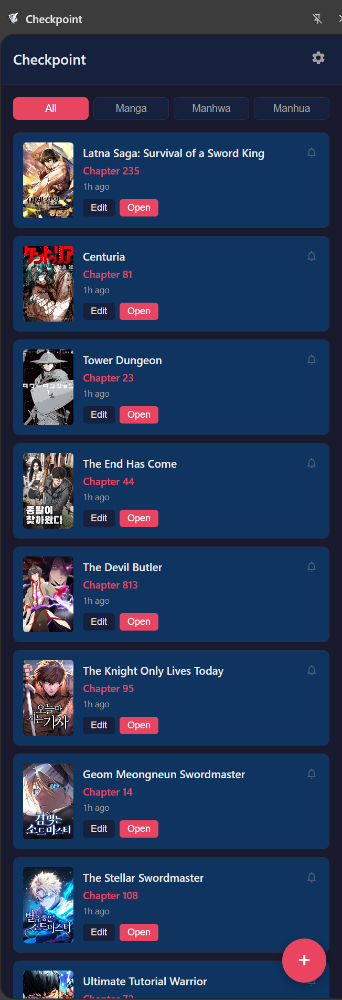
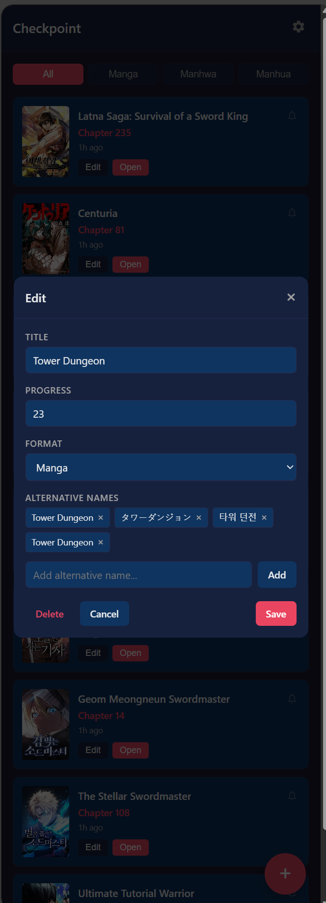
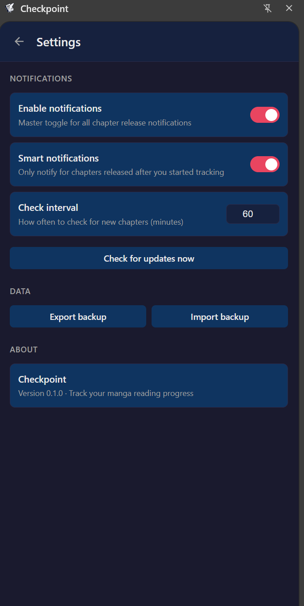

# Checkpoint

A Chrome Side Panel extension that tracks your manga, manhwa, and manhua reading progress across any website, with automatic new chapter notifications.


## Features

### Reading Progress Tracking
- **One-click tracking** - Add your current reading page with a single click
- **Auto-detection** - Automatically extracts title and chapter from any manga reading page
- **Smart progress updates** - Re-adding a manga automatically updates progress if you're on a higher chapter
- **Local title matching** - Recognizes manga by alternative names without API calls
- **Persistent storage** - All data saved locally via Chrome storage

### New Chapter Notifications
- **Automatic chapter checks** - Periodically checks for new chapters in the background
- **Configurable interval** - Set how often to check (default: 60 minutes)
- **Per-item toggle** - Enable/disable notifications for individual titles
- **Smart filtering** - Option to only notify for chapters released after you started tracking
- **Batch notifications** - Summarizes multiple updates to avoid notification spam

### Organization & Filtering
- **Format tabs** - Filter by All, Manga (JP), Manhwa (KR), or Manhua (CN)
- **Progress display** - Shows current chapter and how many chapters you're behind
- **Quick navigation** - Click to open your last reading position

### Multi-Provider Support
- **AniList integration** - Primary source for metadata, covers, and chapter info
- **MangaDex fallback** - Secondary source when AniList data is incomplete
- **Manual search** - Search directly when auto-detection fails
- **Google fallback** - Find alternative names via Google when titles aren't recognized

### Data Management
- **Edit entries** - Manually adjust titles, progress, format, or alternative names
- **Import/Export** - Backup and restore your tracking data
- **Alternative names** - Add custom names for better matching across sites

### UI & Experience
- **Dark theme** - Easy on the eyes during late-night reading sessions
- **Side panel interface** - Always accessible without leaving your reading page

<table>
  <tr>
    <td align="center">
      <br/>
      Tracking List
    </td>
    <td align="center">
      <br/>
      Edit Modal
    </td>
    <td align="center">
      <br/>
      Settings
    </td>
  </tr>
</table>

## Known Limitations

### Chapter Check Accuracy

The "check for new chapters" feature relies on AniList and MangaDex APIs to report total chapter counts. Unfortunately, these APIs often have incomplete or delayed chapter data:

- AniList frequently returns `null` for chapter counts on ongoing series
- MangaDex data can lag behind actual releases
- Neither API provides reliable real-time chapter information

**This functionality is currently weak and may miss new chapter releases or report inaccurate counts.** I'm actively searching for a better API source to improve this feature. Contributions and suggestions are welcome.

## Installation

### From GitHub Release

1. Go to [Releases](https://github.com/elghaied/checkpoint/releases)
2. Download the latest `checkpoint-vX.Y.Z.zip`
3. Extract the ZIP file
4. Load in Chrome:
   - Open `chrome://extensions`
   - Enable "Developer mode" (top right)
   - Click "Load unpacked"
   - Select the extracted folder

### From Source

1. Clone the repository:
   ```bash
   git clone https://github.com/elghaied/checkpoint.git
   cd checkpoint
   ```

2. Install dependencies:
   ```bash
   npm install
   ```

3. Build the extension:
   ```bash
   npm run build
   ```

4. Load in Chrome:
   - Open `chrome://extensions`
   - Enable "Developer mode" (top right)
   - Click "Load unpacked"
   - Select the `dist` folder

5. Pin the extension to your toolbar for easy access

## Usage

1. Navigate to any manga/manhwa/manhua reading page
2. Click the Checkpoint icon in your toolbar to open the side panel
3. Click the **+** button to add the current page
4. Checkpoint checks if you're already tracking this title (by main or alternative names)
   - If found: automatically updates progress if you're on a higher chapter
   - If not found: searches AniList for matches
5. If multiple matches are found, select the correct title
6. Your progress is now tracked!

### Managing Entries

- **Switch tabs** - View All or filter by Manga, Manhwa, or Manhua
- **Edit** - Click "Edit" on any card to change title, progress, format, or alternative names
- **Toggle notifications** - Click the bell icon to enable/disable new chapter alerts
- **Alternative names** - Add/remove alternative names to help Checkpoint recognize the manga on different sites
- **Delete** - Click "Delete" in the edit modal (requires confirmation)
- **Open** - Click "Open" to navigate back to your last reading position

### When Auto-Detection Fails

If Checkpoint doesn't recognize a title:

1. A search modal appears with a search box
2. Type the correct title and click "Search"
3. If you don't know the title, click "Find Alternative Names" to search Google
4. Select the correct result from AniList
5. The original page title is automatically saved as an alternative name for future visits

## Development

### Prerequisites

- Node.js 18+
- npm 9+

### Scripts

```bash
# Development build with watch mode
npm run dev

# Production build
npm run build

# Type checking
npm run typecheck
```

### Project Structure

```
checkpoint/
├── src/
│   ├── sidepanel/          # React UI (Side Panel)
│   │   ├── components/     # React components
│   │   ├── hooks/          # Custom React hooks
│   │   ├── services/       # Chrome messaging service
│   │   └── styles/         # CSS styles
│   ├── background/         # Service Worker
│   │   ├── index.ts        # Message routing
│   │   ├── anilist.ts      # AniList API client
│   │   ├── mangadex.ts     # MangaDex API client
│   │   └── chapterChecker.ts # Background chapter checking
│   ├── content/            # Content Script
│   │   └── index.ts        # Page metadata extraction
│   ├── shared/             # Shared code
│   │   ├── types.ts        # TypeScript types
│   │   └── utils.ts        # Utility functions
│   └── storage/            # Storage abstraction
│       ├── index.ts        # Singleton export
│       └── storageService.ts
├── public/
│   ├── manifest.json       # Chrome extension manifest
│   └── icons/              # Extension icons
├── dist/                   # Built extension (load this in Chrome)
├── vite.config.ts          # Vite build configuration
├── tsconfig.json           # TypeScript configuration
└── package.json
```

### Architecture

The extension has three execution contexts:

1. **Side Panel** - React app for the UI
2. **Background Service Worker** - Central hub for API calls, storage, and chapter checking
3. **Content Script** - Extracts metadata from reading pages

```
User clicks "Add"
       ↓
Side Panel UI
       ↓
Background Service Worker
       ↓
Content Script (extracts title/chapter)
       ↓
Local Storage (check for existing match by title/alt names)
       ↓
[If found] → Update progress → Done
[If not found] ↓
AniList API (metadata lookup)
       ↓
Chrome Storage (persist)
       ↓
Side Panel UI (refresh)
```

## Releasing

This project uses GitHub Actions for automated releases. To create a new release:

### 1. Update Version Numbers

Update the version in both files:

**package.json:**
```json
{
  "version": "X.Y.Z"
}
```

**public/manifest.json:**
```json
{
  "version": "X.Y.Z"
}
```

### 2. Commit and Tag

```bash
# Stage and commit the version bump
git add package.json public/manifest.json
git commit -m "chore: bump version to X.Y.Z"

# Create a version tag (must start with 'v')
git tag vX.Y.Z

# Push both the commit and the tag
git push && git push --tags
```

### 3. Automated Release

Once you push the tag, GitHub Actions will automatically:
1. Run the build process
2. Create a ZIP file of the extension (`checkpoint-vX.Y.Z.zip`)
3. Create a GitHub Release with the ZIP attached
4. Generate release notes from commit history

### 4. Chrome Web Store (Manual)

1. Download the ZIP from the GitHub Release
2. Go to the [Chrome Web Store Developer Dashboard](https://chrome.google.com/webstore/devconsole)
3. Upload the new ZIP
4. Submit for review

## Supported Sites

Checkpoint uses heuristics to extract metadata and should work on most manga reading sites. Tested on:

- MangaDex
- Webtoon
- Tapas
- MangaPlus
- Most generic manga reader sites

If a site doesn't work well, you can manually search and select the correct title. Once you do, Checkpoint saves the site's title as an alternative name so it will be recognized automatically next time.

## Tech Stack

- **Chrome Extensions** - Manifest V3, Side Panel API
- **TypeScript** - Type-safe code
- **React 19** - UI framework
- **Vite** - Build tool
- **AniList GraphQL API** - Primary metadata source
- **MangaDex REST API** - Fallback metadata source

## Privacy

- All data is stored locally in your browser
- No accounts required
- Only makes requests to AniList and MangaDex APIs for metadata lookups
- No tracking or analytics

## Roadmap

- [x] Manual search fallback
- [x] Alternative names management
- [x] Smart progress updates
- [x] New chapter notifications
- [x] Import/Export data
- [ ] Better chapter data API (in progress)
- [ ] Cloud sync (optional)
- [ ] Anime tracking support

## Contributing

1. Fork the repository
2. Create a feature branch (`git checkout -b feature/amazing-feature`)
3. Commit your changes (`git commit -m 'Add amazing feature'`)
4. Push to the branch (`git push origin feature/amazing-feature`)
5. Open a Pull Request

## License

MIT License - see [LICENSE](LICENSE) for details

## Acknowledgments

- [AniList](https://anilist.co) for providing the free API
- [MangaDex](https://mangadex.org) for the fallback API
- Inspired by the need to track reading across multiple sites

---

**Guiding Principle:** Optimize for reading flow, not data perfection. If adding or updating progress isn't effortless, the tool has failed.
