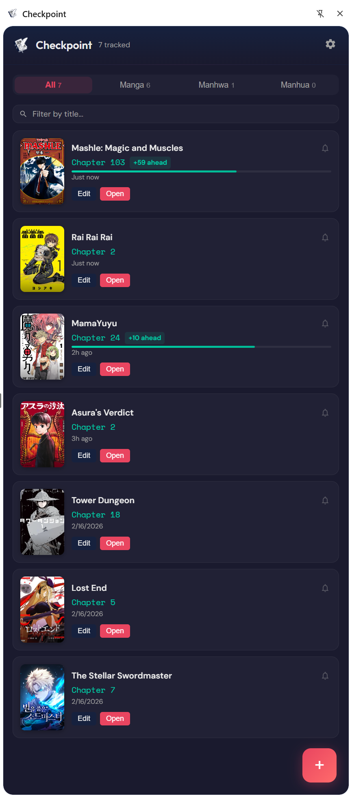
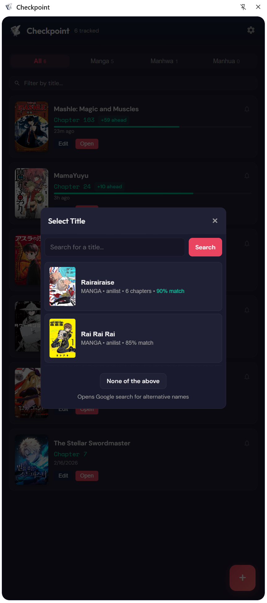
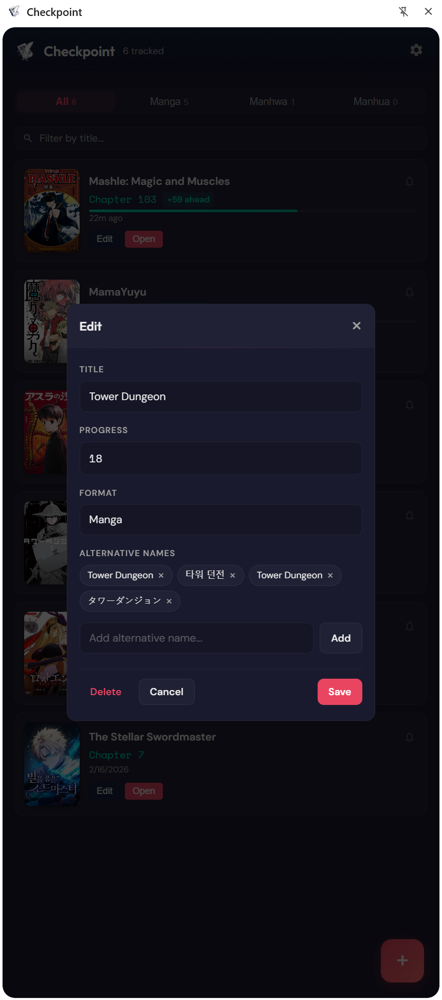
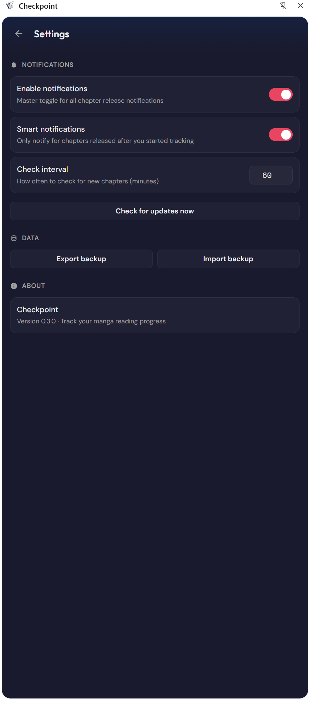

<p align="center">
  
</p>

<h1 align="center">Checkpoint</h1>

<p align="center">
  Track your manga, manhwa, and manhua reading progress across any website.
  <br />
  A Chrome Side Panel extension powered by AniList and MangaDex.
</p>

<p align="center">
  <a href="https://chromewebstore.google.com/detail/checkpoint/bomngiemgfgjnlpanapgbeimmihnjaka"></a>
  <a href="https://github.com/elghaied/checkpoint/actions/workflows/ci.yml"></a>
  <a href="LICENSE"></a>
</p>

<p align="center">
  <a href="https://chromewebstore.google.com/detail/checkpoint/bomngiemgfgjnlpanapgbeimmihnjaka"><strong>Install from Chrome Web Store &rarr;</strong></a>
</p>

<br />

<p align="center">
  &nbsp;&nbsp;
  &nbsp;&nbsp;
  &nbsp;&nbsp;
  
</p>

<br />

## Features

- **One-click tracking** - Add your current page and auto-detect title + chapter
- **Smart progress** - Re-adding a title automatically updates to the higher chapter
- **New chapter notifications** - Background checks with configurable intervals and per-title toggles
- **Format tabs** - Filter by All, Manga (JP), Manhwa (KR), or Manhua (CN)
- **Multi-provider search** - AniList primary, MangaDex fallback, with confidence scoring
- **Alternative names** - Teach Checkpoint to recognize titles across different sites
- **Import / Export** - Back up and restore your full tracking library
- **Side panel UI** - Always accessible without leaving your reading page
- **100% local storage** - No accounts, no tracking, no analytics

## Supported Sites

Checkpoint uses DOM heuristics to extract metadata and works on most manga reading sites including MangaDex, Webtoon, Tapas, MangaPlus, and generic reader sites. When auto-detection fails, search manually and Checkpoint remembers for next time.

## Known Limitations

New chapter detection relies on AniList and MangaDex APIs for chapter counts. These APIs frequently have incomplete or delayed data for ongoing series. This feature may miss releases or report inaccurate counts.

## Tech Stack

| Layer | Technology |
|---|---|
| **Extension** | Chrome Manifest V3, Side Panel API |
| **UI** | React 19, CSS Modules |
| **Language** | TypeScript (strict mode) |
| **Build** | Vite + custom esbuild plugin for content script IIFE bundling |
| **APIs** | AniList GraphQL, MangaDex REST |
| **Testing** | Vitest |
| **CI/CD** | GitHub Actions (typecheck, lint, test on push/PR; auto-release on tags) |

## Architecture

Three execution contexts communicating via `chrome.runtime.sendMessage`:

```
Side Panel (React UI)
       ↕
Background Service Worker ← Alarms (hourly chapter checks)
       ↕                  ← AniList GraphQL API
Content Script            ← MangaDex REST API
(DOM metadata extraction) ← Chrome Storage (local)
```

| Context | Entry Point | Role |
|---|---|---|
| **Side Panel** | `src/sidepanel/main.tsx` | React UI - item list, search, edit, settings |
| **Service Worker** | `src/background/index.ts` | Central hub - API calls, storage, message routing, chapter checking |
| **Content Script** | `src/content/index.ts` | DOM parsing - extracts title and chapter via heuristics (IIFE-bundled) |

### Key Design Decisions

- **Serialization queue** in storage layer prevents race conditions on concurrent mutations
- **TTL cache** (5-min expiry, 100-entry limit) avoids redundant API calls
- **Confidence scoring** uses Levenshtein distance with Jaccard token-overlap fallback; results below 0.7 threshold prompt user selection
- **Content script** is injected on-demand (not on every page) and bundled as IIFE to avoid ES module restrictions

### Project Structure

```
src/
├── sidepanel/           # React UI
│   ├── components/      # 11 components (Header, ItemCard, SearchModal, EditModal, etc.)
│   ├── hooks/           # useTrackedItems, useAddItem, useSettings
│   ├── services/        # Typed chrome.runtime.sendMessage wrapper
│   └── styles/          # CSS Modules per component
├── background/          # Service Worker
│   ├── index.ts         # Message router
│   ├── searchService.ts # Multi-provider search with confidence scoring
│   ├── chapterChecker.ts# Alarm-based batch chapter checking
│   ├── anilist.ts       # AniList GraphQL client
│   ├── mangadex.ts      # MangaDex REST client
│   ├── cache.ts         # TTLCache with LRU eviction
│   └── retry.ts         # Exponential backoff for fetch
├── content/             # Content Script (IIFE)
│   ├── index.ts         # Message listener
│   └── metadata.ts      # DOM parsing (og:title, h1, chapter regex)
├── shared/              # Shared types, utils, constants, logger
└── storage/             # Storage abstraction with serialization queue
```

## Development

### Prerequisites

- Node.js 18+
- npm 9+

### Setup

```bash
git clone https://github.com/elghaied/checkpoint.git
cd checkpoint
npm install
```

### Commands

```bash
npm run dev          # Dev build with watch
npm run build        # Production build with type checking
npm run typecheck    # TypeScript validation
npm run lint         # ESLint
npm run test         # Vitest
npm run test:watch   # Vitest in watch mode
```

Load the `dist/` folder as an unpacked extension at `chrome://extensions` (Developer mode).

### Releasing

1. Update version in `package.json` and `public/manifest.json`
2. Commit, tag (`git tag vX.Y.Z`), and push with tags
3. GitHub Actions builds, zips, and creates a GitHub Release automatically

## Contributing

1. Fork the repo
2. Create a feature branch (`git checkout -b feature/amazing-feature`)
3. Commit your changes
4. Push and open a Pull Request

CI runs typecheck, lint, and tests on all PRs.

## License

MIT - see [LICENSE](LICENSE) for details.

## Acknowledgments

[AniList](https://anilist.co) and [MangaDex](https://mangadex.org) for their free APIs.

---

<p align="center"><em>Optimize for reading flow, not data perfection.</em></p>
