<p align="center">
  
</p>

<h1 align="center">Checkpoint</h1>

<p align="center">
  Track your manga, manhwa, and manhua reading progress across any website.
  <br />
  A Chrome Side Panel extension powered by AniList and MangaDex.
</p>

<p align="center">
  <a href="https://chromewebstore.google.com/detail/checkpoint/bomngiemgfgjnlpanapgbeimmihnjaka"></a>
  <a href="https://github.com/elghaied/checkpoint/actions/workflows/ci.yml"></a>
  <a href="LICENSE"></a>
</p>

<p align="center">
  <a href="https://chromewebstore.google.com/detail/checkpoint/bomngiemgfgjnlpanapgbeimmihnjaka"><strong>Install from Chrome Web Store &rarr;</strong></a>
</p>

<br />

<p align="center">
  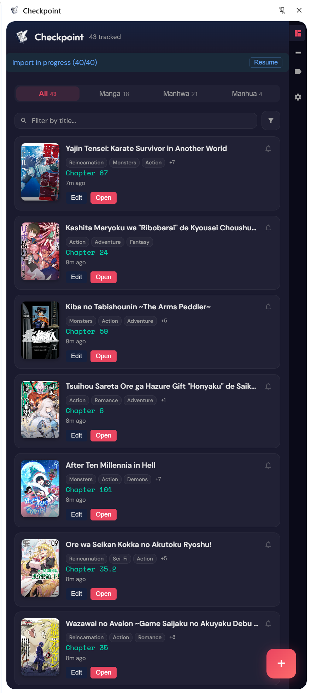&nbsp;&nbsp;
  &nbsp;&nbsp;
  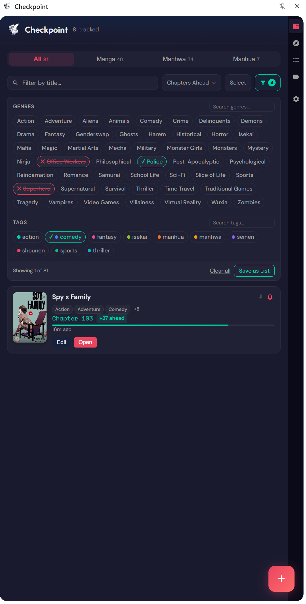&nbsp;&nbsp;
  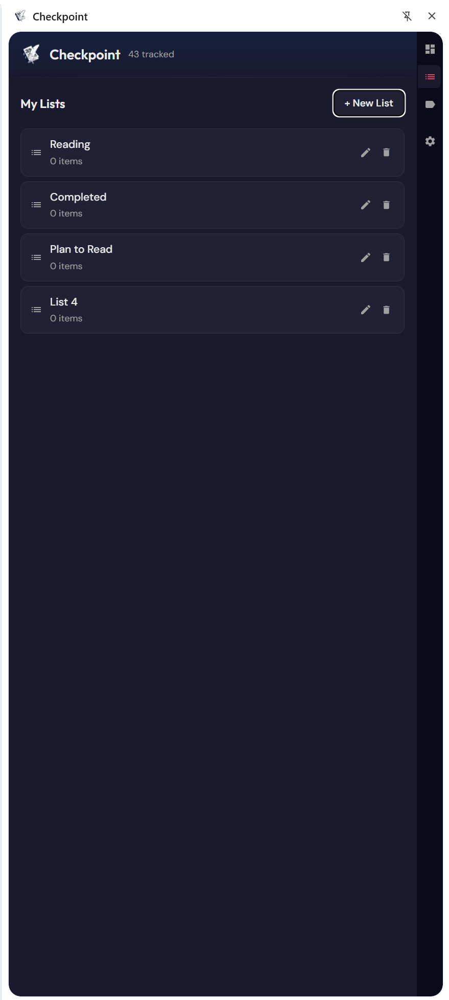&nbsp;&nbsp;
  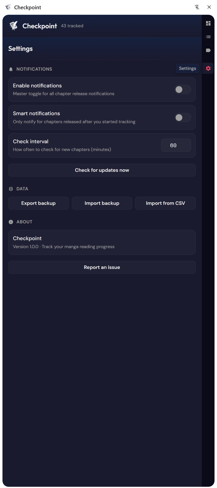
</p>

<br />

## What is Checkpoint?

Checkpoint lives in Chrome's side panel — it stays open next to your reading page so you never have to switch tabs. When you're on a manga site, hit the **+** button and Checkpoint auto-detects what you're reading and which chapter you're on. It looks up the title on AniList and MangaDex, grabs the cover art and metadata, and saves it to your local library. Next time you read a new chapter of the same title, add it again and your progress updates automatically (it never goes backwards).

Everything is stored locally on your device. No accounts, no tracking, no analytics.

## Getting Started

1. Install from the [Chrome Web Store](https://chromewebstore.google.com/detail/checkpoint/bomngiemgfgjnlpanapgbeimmihnjaka)
2. Open the side panel (click the Checkpoint icon or use `Ctrl+Shift+Y`)
3. Navigate to any manga reading site
4. Click the **+** button to start tracking

## Features

### Tracking & Progress

- **One-click tracking** — Navigate to any chapter on any manga site and click **+**. Checkpoint detects the title and chapter number automatically.
- **Smart progress** — If you re-add a title at a higher chapter, your progress updates. It never goes backwards, so you can't accidentally lose your place.
- **Continue reading** — Each title remembers where you were last reading. Click **Open** to jump right back.

### Organizing Your Library

#### Tags

Create your own tags (like "Favorites", "On Hold", "Must Read") to organize titles your way. Tags get a color dot automatically, and you can change the color anytime.

To add a tag: open a title's **Edit** modal, type in the **Tags** field, and press Enter. Manage all your tags from the **Tags** view in the side navigation.

<p align="center">
  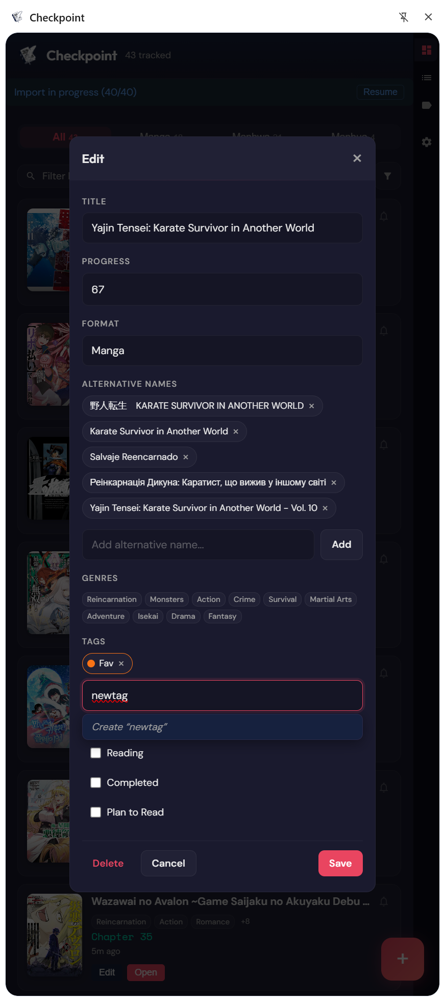&nbsp;&nbsp;
  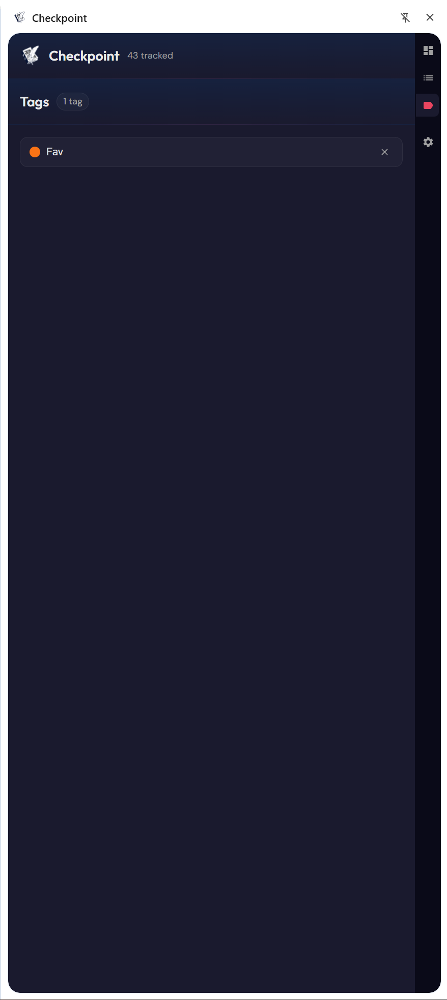
</p>

#### Lists

Organize titles into lists like "Reading", "Completed", or "Plan to Read" (these three are created by default). You can add as many custom lists as you want. Click a list to see its contents, and use **+ Add Items** to pick titles from your library.

<p align="center">
  &nbsp;&nbsp;
  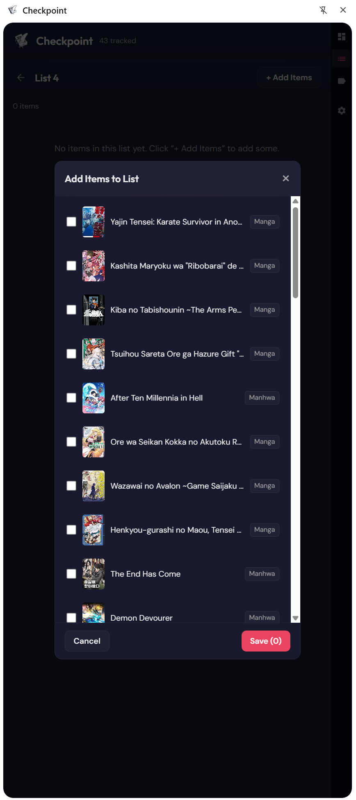
</p>

#### Filtering

Use the filter panel to narrow down your library. Checkpoint uses a **tri-state filter** system for genres and tags — click a genre or tag once, twice, or three times to cycle through:

| State | Color | Meaning | Example |
|-------|-------|---------|---------|
| **AND** | Green | Title **must** have this | Green "Action" = only show titles tagged Action |
| **OR** | Blue | Title can have **any** of these | Blue "Action" + Blue "Comedy" = show titles that have Action OR Comedy |
| **Exclude** | Red | Title must **not** have this | Red "Romance" = hide all Romance titles |

You can combine these freely. For example: AND "Action" + OR "Fantasy" + OR "Adventure" + Exclude "Romance" shows Action titles that also have Fantasy or Adventure, but nothing with Romance.

The filter panel also works together with the **format tabs** (All, Manga, Manhwa, Manhua) at the top.

<p align="center">
  
</p>

### Notifications

Checkpoint can check for new chapter releases in the background and send you a browser notification when something you're tracking gets updated.

- **Enable notifications** — Master toggle in Settings
- **Smart notifications** — Only notify for chapters released *after* you started tracking (so you don't get flooded with old releases)
- **Check interval** — How often to check (default: 60 minutes)
- **Per-title control** — Toggle notifications for individual titles in the Edit modal

> **Note:** Chapter counts come from AniList and MangaDex APIs, which can have incomplete or delayed data for some series. Notifications may occasionally miss releases.

### CSV Bulk Import

If you have a reading list in a spreadsheet (Excel, Google Sheets, etc.), you can import it all at once instead of adding titles one by one.

#### Preparing Your CSV

**From Excel:** File > Save As > choose "CSV (Comma delimited) (*.csv)"

**From Google Sheets:** File > Download > Comma Separated Values (.csv)

Your CSV needs a **title** column (required). These other columns are optional:

| Column | What it does | Example |
|--------|-------------|---------|
| `title` | The manga/manhwa name | One Piece |
| `ch` or `chapter` | Your current chapter | 1120 |
| `url` or `link` | Where you read it | https://mangadex.org/chapter/abc123 |
| `tags` or `tag` | Comma-separated tags | action, shounen |

Column names are case-insensitive (`Title`, `TITLE`, `title` all work). Any extra columns are ignored, so you don't need to clean up your spreadsheet first.

**Example CSV:**
```
title,ch,url,tags
One Piece,1120,https://mangadex.org/chapter/abc123,shounen
Jujutsu Kaisen,268,,action
Solo Leveling,200,https://manganato.com/manga-dr980474/chapter-200,action
```

#### How Import Works

1. **Upload** — Go to Settings > **Import from CSV** (or open the import tab directly). Pick your CSV file. Checkpoint shows a preview so you can verify it parsed correctly.

<p align="center">
  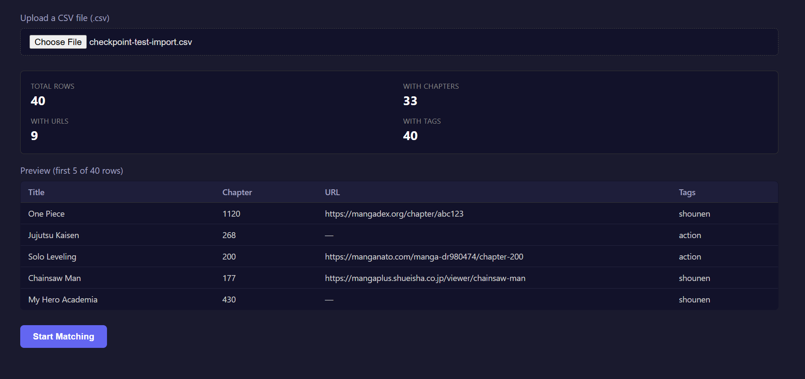
</p>

2. **Matching** — Checkpoint searches AniList and MangaDex for each title. A progress bar shows how far along it is. You can pause and resume at any time — your progress is saved even if you close the tab.

3. **Review** — See all results in a table with color-coded confidence levels:
   - **Green** = high confidence match
   - **Yellow** = possible match, worth checking
   - **Red** = couldn't find a match automatically

   Click any title's action button to see alternatives, search by a different name, or skip it.

<p align="center">
  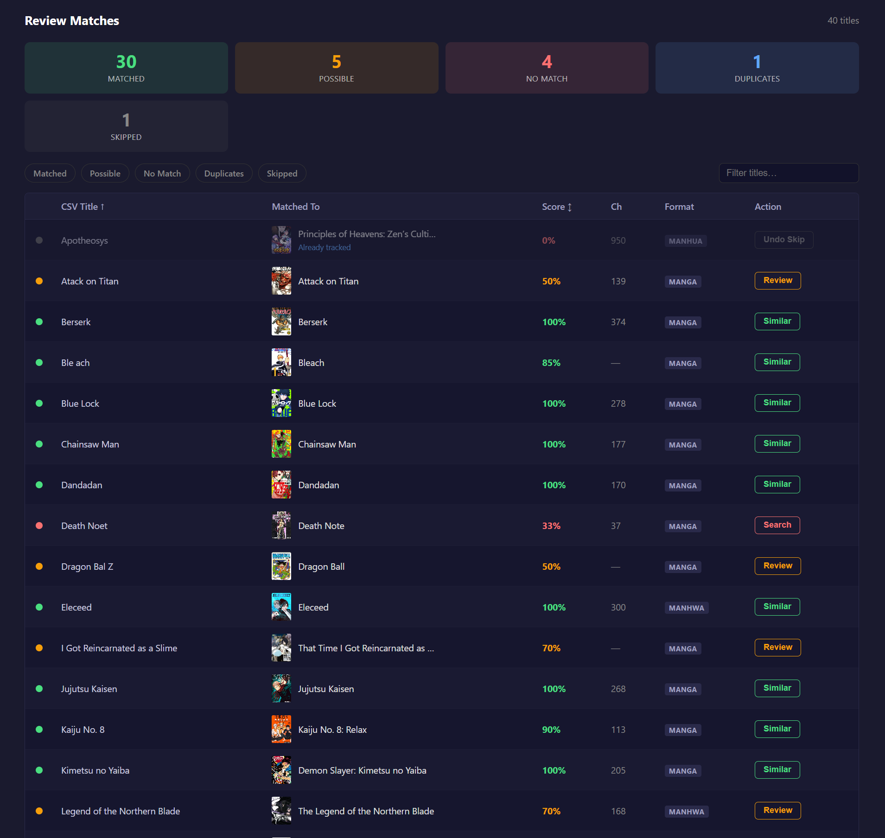&nbsp;&nbsp;
  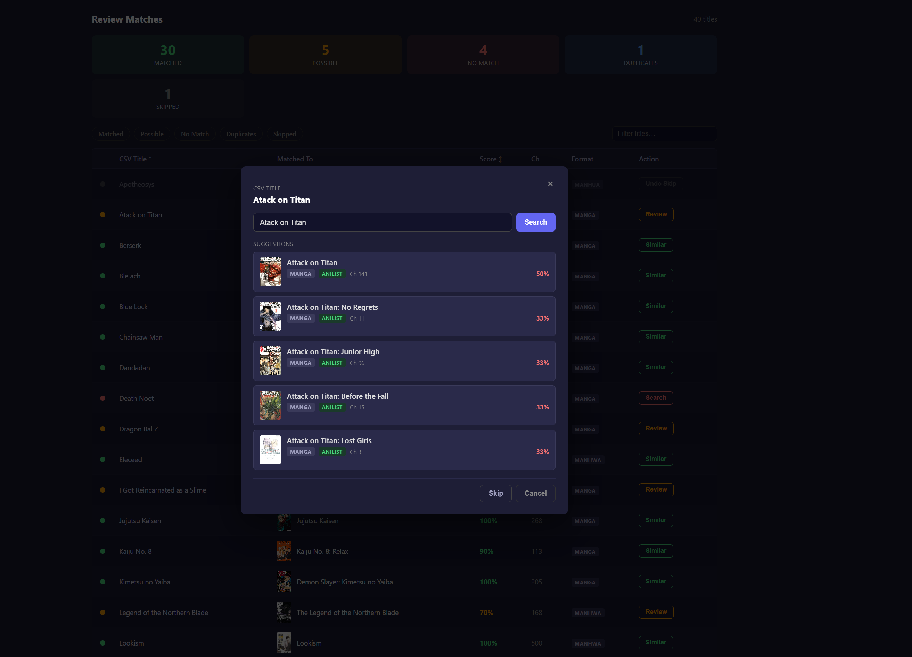
</p>

4. **Confirm** — Choose which tiers to import. Matched titles are selected by default. Click **Import Selected** to add them to your library. Titles you didn't import can be exported as a CSV for another try later.

<p align="center">
  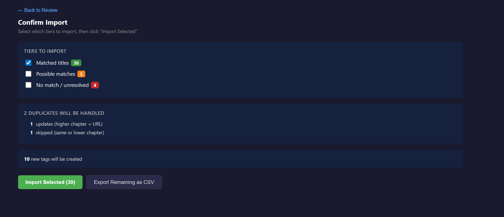
</p>

### Backup & Restore

In Settings, you can:

- **Export backup** — Download your full library (titles, tags, lists, settings) as a JSON file
- **Import backup** — Restore from a previous backup
- **Report an issue** — Opens GitHub Issues if you run into problems

<p align="center">
  
</p>

## Supported Sites

Checkpoint works on most manga reading sites including MangaDex, Webtoon, Tapas, MangaPlus, and generic reader sites. It uses page metadata (title, URL patterns, heading text) to detect what you're reading. When auto-detection doesn't work on a particular site, search for the title manually — Checkpoint remembers the association for next time via the **Alternative Names** feature in the Edit modal.

---

## For Developers

### Tech Stack

| Layer | Technology |
|---|---|
| **Extension** | Chrome Manifest V3, Side Panel API |
| **UI** | React 19, BEM CSS |
| **Language** | TypeScript (strict mode) |
| **Build** | Vite + custom esbuild plugin for content script IIFE bundling |
| **APIs** | AniList GraphQL, MangaDex REST |
| **Testing** | Vitest |
| **CI/CD** | GitHub Actions (typecheck, lint, test on push/PR; auto-release on tags) |

### Architecture

Four execution contexts communicating via `chrome.runtime.sendMessage`:

```
Side Panel (React UI)     Import Tab (React UI)
       ↕                         ↕
Background Service Worker ← Alarms (hourly chapter checks)
       ↕                  ← AniList GraphQL API
Content Script            ← MangaDex REST API
(DOM metadata extraction) ← Chrome Storage (local)
```

| Context | Entry Point | Role |
|---|---|---|
| **Side Panel** | `src/sidepanel/main.tsx` | React UI - item list, search, edit, lists, tags, settings |
| **Import Tab** | `src/import/main.tsx` | CSV bulk import - parse, batch match, review, confirm (dedicated browser tab) |
| **Service Worker** | `src/background/index.ts` | Central hub - API calls, storage, message routing, chapter checking, rate limiting |
| **Content Script** | `src/content/index.ts` | DOM parsing - extracts title and chapter via heuristics (IIFE-bundled) |

### Key Design Decisions

- **Serialization queue** in storage layer prevents race conditions on concurrent mutations
- **TTL cache** (5-min expiry, 100-entry limit) avoids redundant API calls
- **Confidence scoring** uses Levenshtein distance with Jaccard token-overlap fallback; results below 0.7 threshold prompt user selection (bulk import uses stricter 0.85/0.50 green/yellow thresholds)
- **Sliding window rate limiter** enforces 75 requests/minute during CSV import to stay within AniList's 90/min ceiling
- **Content script** is injected on-demand (not on every page) and bundled as IIFE to avoid ES module restrictions
- **Tri-state filter engine** evaluates AND/OR/Exclude logic per filter entry, composable across genres, tags, and format

### Project Structure

```
src/
├── sidepanel/           # Side Panel React UI
│   ├── components/      # NavRail, ItemCard, FilterPanel, EditModal, ImportBanner, etc.
│   ├── hooks/           # useTrackedItems, useAddItem, useFilterPanel, useCustomTags, etc.
│   ├── services/        # Typed chrome.runtime.sendMessage wrapper
│   └── styles/          # Global CSS with BEM design tokens
├── import/              # CSV Import Tab (dedicated browser tab)
│   ├── components/      # FileUpload, MatchProgress, ReviewTable, SimilarModal, ConfirmPanel
│   ├── hooks/           # useImportSession, useBatchMatcher
│   ├── services/        # Import-specific messaging wrapper
│   ├── csvParser.ts     # PapaParse-based CSV parser with column detection
│   └── confirmLogic.ts  # Tier classification, duplicate detection, diagnostic CSV export
├── background/          # Service Worker
│   ├── index.ts         # Message router
│   ├── searchService.ts # Multi-provider search with confidence scoring
│   ├── chapterChecker.ts# Alarm-based batch chapter checking
│   ├── rateLimiter.ts   # Sliding window rate limiter for import API calls
│   ├── anilist.ts       # AniList GraphQL client
│   ├── mangadex.ts      # MangaDex REST client
│   ├── cache.ts         # TTLCache with LRU eviction
│   └── retry.ts         # Exponential backoff for fetch
├── content/             # Content Script (IIFE)
│   ├── index.ts         # Message listener
│   └── metadata.ts      # DOM parsing (og:title, h1, chapter regex)
├── shared/              # Shared types, utils, constants, logger, filter engine
└── storage/             # Storage abstraction with serialization queue
```

### Development Setup

**Prerequisites:** Node.js 18+, npm 9+

```bash
git clone https://github.com/elghaied/checkpoint.git
cd checkpoint
npm install
```

**Commands:**

```bash
npm run dev          # Dev build with watch
npm run build        # Production build with type checking
npm run typecheck    # TypeScript validation
npm run lint         # ESLint
npm run test         # Vitest
npm run test:watch   # Vitest in watch mode
```

Load the `dist/` folder as an unpacked extension at `chrome://extensions` (Developer mode).

### Releasing

1. Update version in `package.json` and `public/manifest.json`
2. Commit, tag (`git tag vX.Y.Z`), and push with tags
3. GitHub Actions builds, zips, and creates a GitHub Release automatically

### Contributing

1. Fork the repo
2. Create a feature branch (`git checkout -b feature/amazing-feature`)
3. Commit your changes
4. Push and open a Pull Request

CI runs typecheck, lint, and tests on all PRs.

## License

MIT - see [LICENSE](LICENSE) for details.

## Acknowledgments

[AniList](https://anilist.co) and [MangaDex](https://mangadex.org) for their free APIs.

---

<p align="center"><em>Optimize for reading flow, not data perfection.</em></p>
